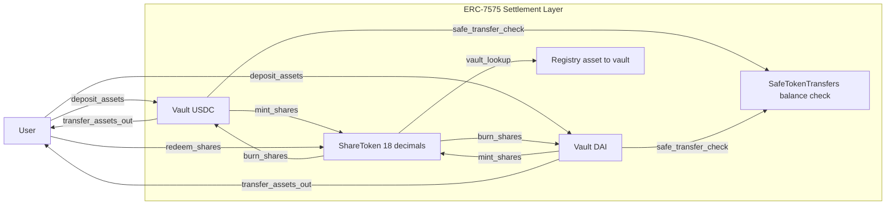

# mini-7575-vault

Multi-asset synchronous vault (ERC-7575 settlement layer).

`mini-7575-vault` is a Foundry portfolio project for a reduced ERC-7575 design:
multiple asset vaults share one 18-decimal share token, with synchronous deposit/redeem.

## Why this repo

- Build a practical bridge between ERC-4626 basics and full ERC-7575 production stacks
- Focus on settlement correctness, decimal normalization, and test-first development
- Keep scope intentionally reduced (no full KYC/permit/off-chain orchestration)

## Public Roadmap

- Milestones and acceptance criteria: **[MILESTONES.md](./MILESTONES.md)**
- Internal day-by-day execution plan is maintained in the companion repo:
  - `smart-contract-security-roadmap/mini-7575-vault-internal-roadmap.md`

## How to run

### Prerequisites

- Foundry installed (`forge`, `anvil`, `cast`)
- Git submodules available (`lib/forge-std`, `lib/openzeppelin-contracts`)

### Install dependencies

```bash
forge install
```

### Build

```bash
forge build
```

### Test

```bash
forge test -vv
```

### Static analysis (Slither)

Slither is integrated in CI (`.github/workflows/test.yml`) with a dedicated `slither` job.

Recommended local setup:

- Python `3.12` (recommended for compatibility)
- `slither-analyzer`

```bash
python -m pip install --upgrade pip slither-analyzer
slither . --exclude-low --exclude-informational --exclude-optimization --filter-paths "lib|test|script|out|cache|broadcast|.deps|artifacts"
```

Windows workaround (when `slither .` cannot invoke `forge` from Python):

```powershell
powershell -ExecutionPolicy Bypass -File .\script\run-slither.ps1
```

Scan all contracts under `src/`:

```powershell
powershell -ExecutionPolicy Bypass -File .\script\run-slither.ps1 -AllSource
```

### Run a local node

```bash
anvil
```

## How to deploy (local example)

There is no dedicated deployment script yet. Use `forge create` directly for now.

### 1) Deploy mock asset

```bash
forge create src/mocks/MockERC20.sol:MockERC20 \
  --rpc-url http://127.0.0.1:8545 \
  --private-key <ANVIL_PRIVATE_KEY> \
  --constructor-args "Mock USDC" "mUSDC" 18
```

### 2) Deploy vault with asset address

```bash
forge create src/Vault.sol:Vault \
  --rpc-url http://127.0.0.1:8545 \
  --private-key <ANVIL_PRIVATE_KEY> \
  --constructor-args <MOCK_ERC20_ADDRESS>
```

### 3) Optional quick interaction with `cast`

```bash
cast call <VAULT_ADDRESS> "asset()(address)" --rpc-url http://127.0.0.1:8545
cast call <VAULT_ADDRESS> "previewDeposit(uint256)(uint256)" 1000000000000000000 --rpc-url http://127.0.0.1:8545
```

## System Architecture



## Current Status

- [x] Scope and milestones are defined
- [x] Minimal runnable `deposit/redeem` baseline is implemented
- [ ] Safe transfer hardening (`SafeTokenTransfers`) in progress
- [ ] Public test coverage report pending

## Companion

[smart-contract-security-lab](https://github.com/huichain/smart-contract-security-lab) — vulnerability PoCs and audit-style reports
